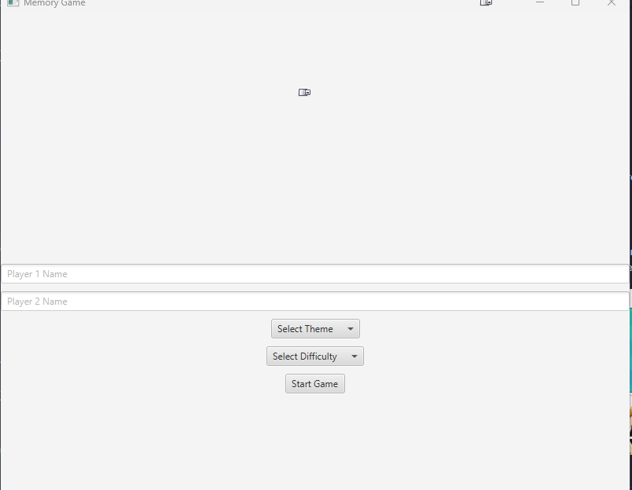
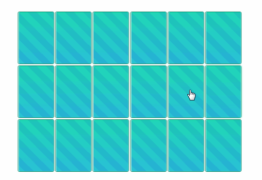

# Memory Game

Memory Game est un jeu classique de correspondance de cartes. Il est codé en Java et utilise JavaFX pour l'interface graphique.

## Prérequis

Vous devez avoir Java 8 ou une version ultérieure et JavaFX installés sur votre système pour exécuter ce jeu.

## Comment jouer

Lorsque vous démarrez le jeu, vous verrez un écran de démarrage où vous pouvez entrer les noms des joueurs et choisir le thème et la difficulté du jeu.

Après avoir cliqué sur "Start", le jeu commence. Les cartes sont disposées face cachée. Chaque joueur a son tour pour retourner deux cartes. Si les cartes correspondent, elles sont retirées du plateau et ajoutées à la main du joueur.

Le jeu se termine lorsque toutes les paires de cartes ont été trouvées. Le joueur avec le plus grand nombre de paires gagne la partie.

## Fonctionnalités

- Choix du thème : Vous pouvez choisir parmi différents thèmes pour les images sur les cartes.
- Difficulté : Choisissez parmi plusieurs niveaux de difficulté, qui déterminent le nombre de paires de cartes dans le jeu.
- Tour par tour : Les joueurs jouent à tour de rôle, ce qui rend le jeu parfait pour jouer avec des amis.

## Développement

Ce jeu a été développé en utilisant IntelliJ IDEA. Pour lancer le projet dans IntelliJ, ouvrez simplement le dossier du projet et lancez le fichier `Main.java`.

Nous vous invitons à contribuer à ce projet en soumettant des problèmes ou des pull requests.

## Licence

Ce projet est sous licence MIT - voir le fichier [LICENSE](LICENSE) pour plus de détails.
